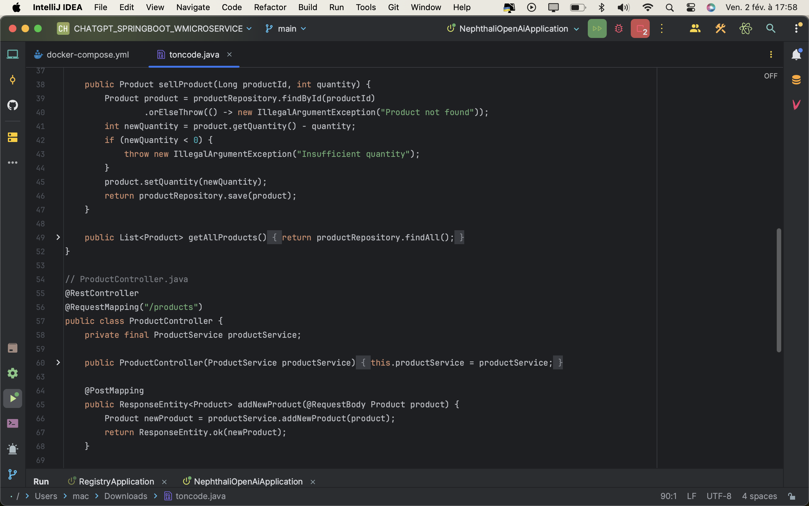

# APP_CHATGPT_SPRINGBOOT_ANGULAR_WMICROSERVICE

<h1>Eureka</h1>

<h2>Docker compose</h2>

<h1>Docker Image</h1>

<h4>Docker Conteneur</h4>

<h3>Chatgpt</h3>

<h2>Requete et reponse </h2>

<h2>Telechargement du code </h2>

<h1>Repertoire</h1>

<h1>code</h1>

<h3>2</h3>

<h4>3</h4>

